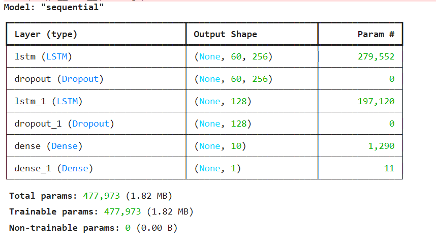
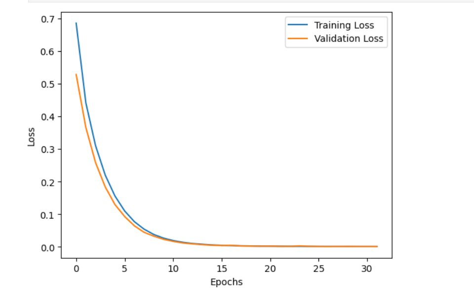
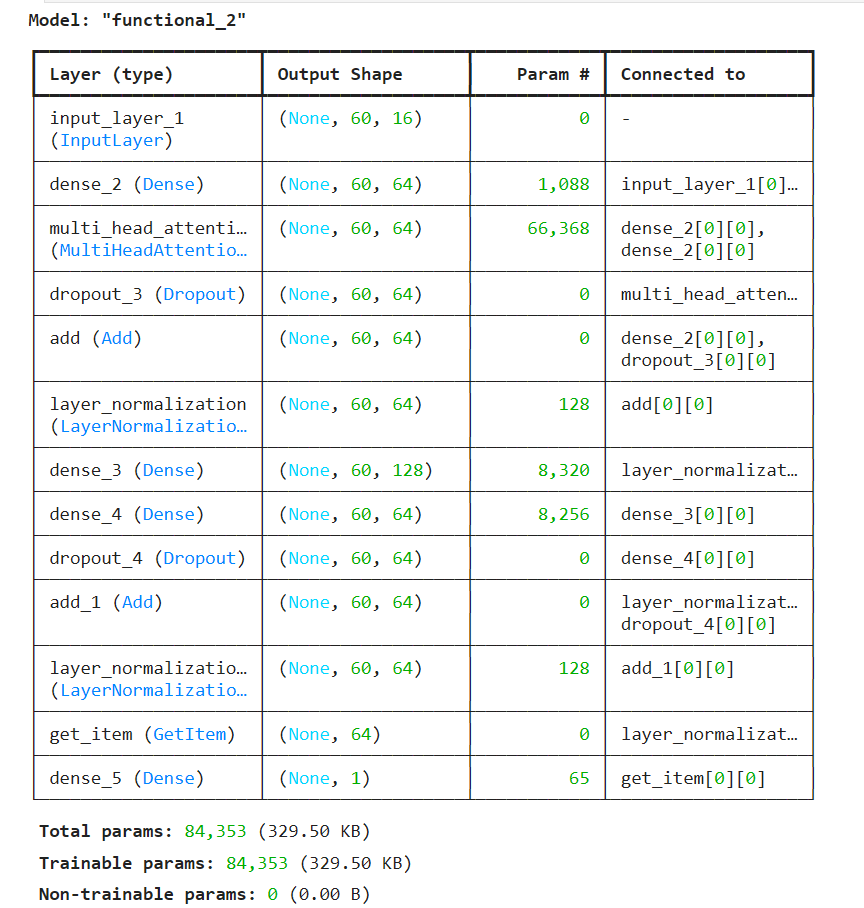
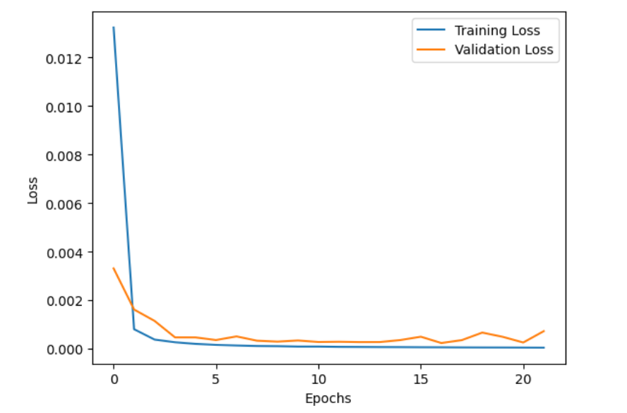

<h1>TimeFlex Trader</h1>
<ul>
  <li>Developed hybrid deep learning models (LSTM & Transformer) for stock price prediction with 96% R² and minimal
RMSE.</li>
  <li>Enhanced predictions using rolling statistics and volatility metrics.</li>
  <li>Built a data pipeline for preprocessing and normalization to optimize forecasting performance.</li>
</ul>
<h2>Abstract</h2>

This project presents a comprehensive study on time-series prediction using Long Short-Term Memory (LSTM), Transformer-based models, and hybrid approaches combining these techniques. Leveraging various feature engineering techniques, we preprocess and normalize financial time-series data to achieve improved predictive performance. Key feature engineering techniques include deriving time-based attributes such as Hour, DayOfWeek, Quarter, and IsWeekend, as well as statistical metrics like RollingMean, RollingStd, RollingSkew, and Volatility. Exponential Moving Average (EMA) and percentage price changes were also computed to enhance data representation. Data preprocessing involved forward and backward filling to address missing values and applying MinMaxScaler for normalization. These methods collectively improved model input quality and predictive reliability. Our models are trained and evaluated on key metrics such as Root Mean Square Error (RMSE) and R-squared, achieving high accuracy and robust predictions. We compare the performance of these models and discuss their applications in financial forecasting, including ensemble methods for enhanced reliability.

<h2>Setup</h2>

Navigate to the folder where you want to clone the project

<h3>Git Clone</h3>
<code>git clone https://github.com/HiteshReddy28/TimeFlex-Trader.git</code>
<h3>Environments setup</h3>

After cloning create a Python environment using the following command

<code>python -m venv env</code>
<h3>Activate the environment</h3>
<code>cd env
./Scripts/activate</code>
<h3>Install all the reqirements</h3>
<code>pip install -r requirements.txt</code>
<h3>Open the file in jupyter notebook</h3>

Navigate to the location of the timeflextrader.ipynb file, open the command prompt, and enter the following code

Make sure you have Juputer notebook in environmental variable 

<code>jupyter notebook</code>

<h2>Run the code</h2>

Execute all the cells in the jupyter notebook by using <code>shift + enter</code>

<h2>Explaination</h2>

<h2>Results</h2>

  The LSTM model demonstrated superior performance in capturing long-term temporal dependencies, achieving an RMSE of 0.0119 and R² of 0.985. The Transformer model, while achieving similar accuracy, offered faster training times and computational efficiency due to its parallelized architecture. The hybrid and ensemble models outperformed individual models in terms of robustness and accuracy, showcasing the potential of combining methodologies.

  

Visualization of model predictions against actual values highlights the ability of all models to follow trends and adapt to fluctuations in financial data. Notably, the ensemble methods reduced prediction variance, providing more consistent results.

Further analysis revealed that the hybrid models improved performance metrics and offered better adaptability to abrupt market changes, as seen during high volatility periods. The combined strengths of LSTM and Transformer architectures contributed to capturing both long-term trends and short-term variations effectively.

<h4>LSTM Architecture</h4>

<h4>LSTM loss VS number of epochs</h4>

<h4>Transformer Architecture</h4>

<h4>Transformer loss VS number of epochs</h4>\

